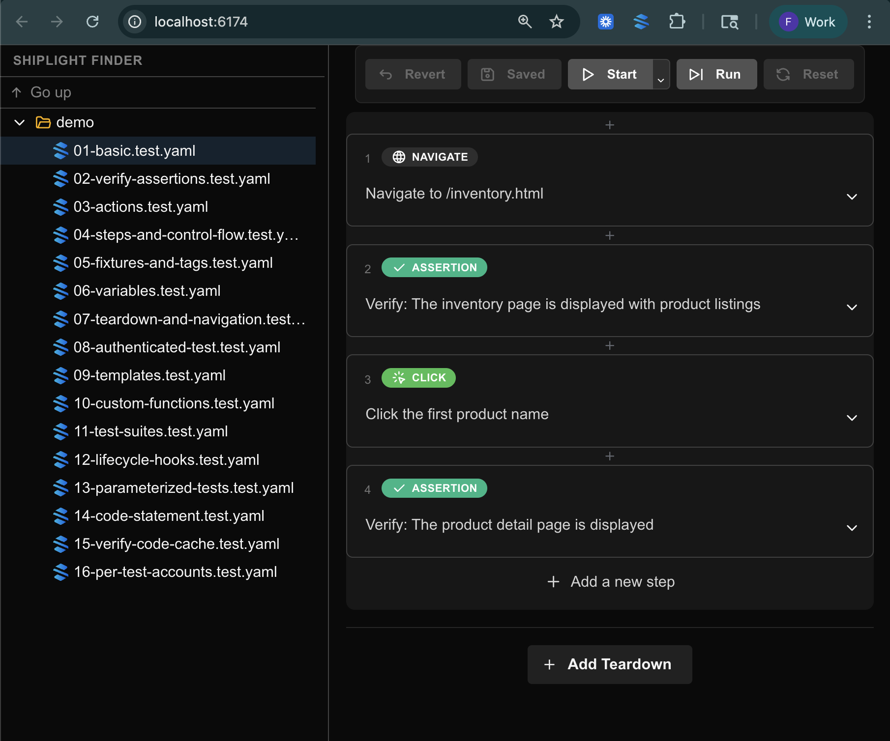
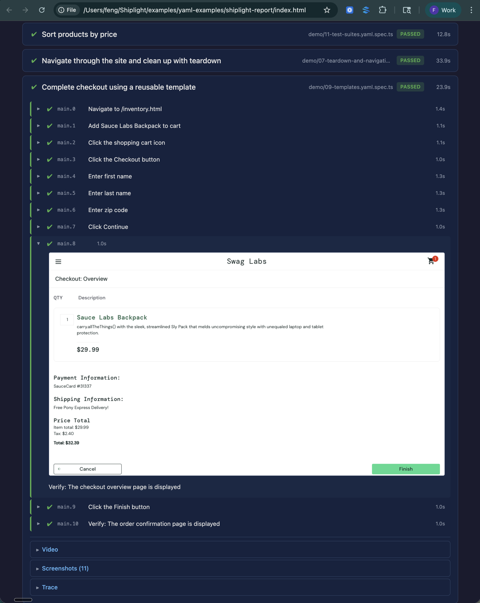

# YAML Test Examples

Runnable YAML test examples for [shiplightai](https://www.npmjs.com/package/shiplightai). Each file demonstrates specific features of the YAML test format.

All examples target the public [Sauce Labs demo site](https://www.saucedemo.com/) — no account required.

## Setup

```bash
npm install
npx playwright install chromium
cp .env.example .env
# Edit .env and add your API key
```

## Run

```bash
# Run all examples (auth setup runs automatically as a dependency)
npx shiplight test --project demo

# Run a single example
npx shiplight test demo/01-basic.test.yaml

# Run everything
npx shiplight test
```

## Examples

| File | Features |
|------|----------|
| [`01-basic.test.yaml`](./demo/01-basic.test.yaml) | `goal`, `url`, draft statements, inline `VERIFY` |
| [`02-verify-assertions.test.yaml`](./demo/02-verify-assertions.test.yaml) | Multiple `VERIFY` assertions |
| [`03-actions.test.yaml`](./demo/03-actions.test.yaml) | `action_entity` with `locator`/`xpath`, `click`, `input_text`, `press`, `clear_input`, `select_dropdown_option`, `scroll`, `verify` |
| [`04-steps-and-control-flow.test.yaml`](./demo/04-steps-and-control-flow.test.yaml) | `STEP` grouping, `IF`/`ELSE` (AI + `js:` conditions), `WHILE` loops |
| [`05-fixtures-and-tags.test.yaml`](./demo/05-fixtures-and-tags.test.yaml) | `name`, `tags`, `use:` (viewport, locale) |
| [`06-variables.test.yaml`](./demo/06-variables.test.yaml) | `{{VAR_NAME}}` in action_entity kwargs |
| [`07-teardown-and-navigation.test.yaml`](./demo/07-teardown-and-navigation.test.yaml) | `teardown`, `go_back`, `go_to_url`, `reload_page`, `save_variable` |
| [`08-authenticated-test.test.yaml`](./demo/08-authenticated-test.test.yaml) | `storageState` via project setup, authenticated tests |
| [`09-templates.test.yaml`](./demo/09-templates.test.yaml) | `template:` with params, env var pass-through |
| [`10-custom-functions.test.yaml`](./demo/10-custom-functions.test.yaml) | `call:` with `file#export` syntax, `args` |
| [`11-test-suites.test.yaml`](./demo/11-test-suites.test.yaml) | `suite` with multiple tests, sequential execution |
| [`12-lifecycle-hooks.test.yaml`](./demo/12-lifecycle-hooks.test.yaml) | `beforeAll`, `beforeEach`, `afterEach`, `afterAll` hooks |
| [`13-parameterized-tests.test.yaml`](./demo/13-parameterized-tests.test.yaml) | `parameters` with `<<variable>>` substitution |
| [`14-code-statement.test.yaml`](./demo/14-code-statement.test.yaml) | `JS:` shorthand for inline JavaScript |
| [`15-verify-code-cache.test.yaml`](./demo/15-verify-code-cache.test.yaml) | `VERIFY` with `js:` cache, try/catch AI fallback |
| [`16-per-test-accounts.test.yaml`](./demo/16-per-test-accounts.test.yaml) | Per-test account fixtures with `auth:` |

### Supporting files

| File | Purpose |
|------|---------|
| [`templates/checkout.yaml`](./templates/checkout.yaml) | Reusable checkout template with params |
| [`helpers/cart.ts`](./helpers/cart.ts) | TypeScript helper for function action example |
| [`demo/auth.setup.ts`](./demo/auth.setup.ts) | Playwright setup project for authentication |
| [`demo/auth.login.ts`](./demo/auth.login.ts) | Login script used by auth setup |

## Authentication

The `setup` project in `playwright.config.ts` handles authentication using Playwright's project dependencies:

1. `auth.setup.ts` runs before tests, using AI to log in
2. Cookies are saved to `.auth/storageState.json`
3. The `demo` project depends on `setup`, so tests start authenticated

## Debug a test locally

```bash
npx shiplight debug --open
```

Opens a headed browser with the Shiplight debugger, so you can step through a test interactively.



## View Shiplight results

```bash
open shiplight-report/index.html
```

See step-by-step screenshots, video, trace, and more for each test run.



## Documentation

- [YAML Test Language Spec](./YAML-TEST-LANGUAGE-SPEC.md) — full YAML format reference
- [Shiplight Docs](https://docs.shiplight.ai) — platform documentation
